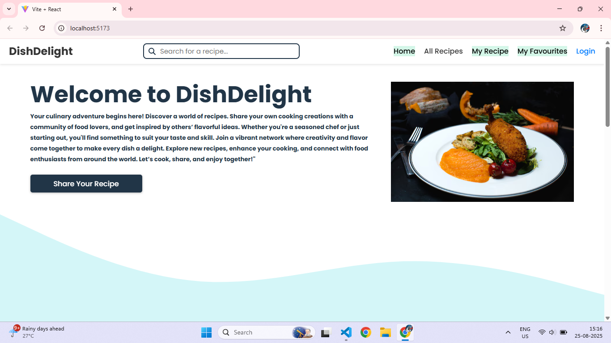
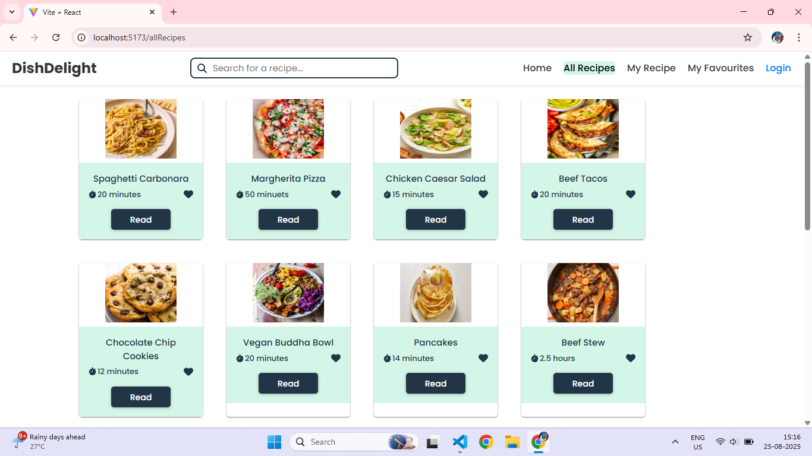
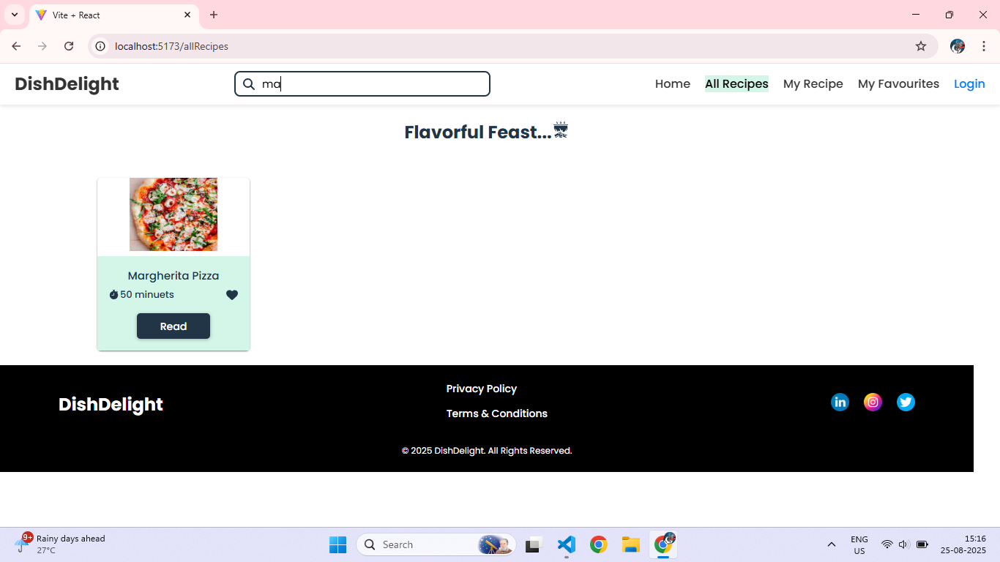
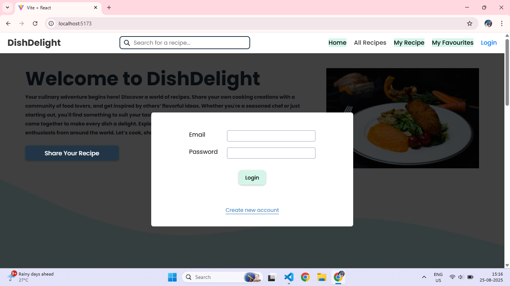
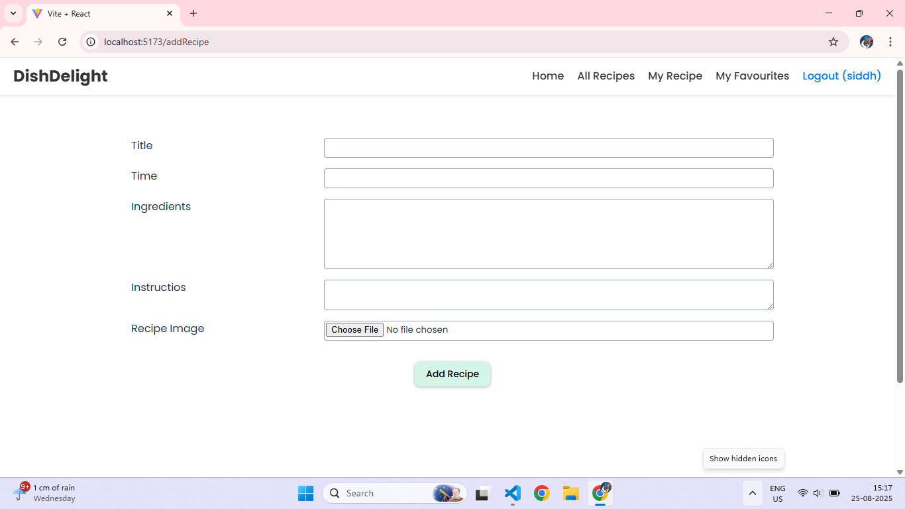

# 🍴 DishDelight – Recipe Sharing Platform

DishDelight is a modern **recipe-sharing web application** built with **React + Vite**.
It allows users to **browse, search, and share recipes** with the community. Users can log in, create their own recipes, save favourites, and explore dishes from around the world.

---

## 🚀 Features

* 🔎 **Recipe Search** – Instantly search recipes by name.
* 📚 **All Recipes Page** – Browse a wide collection of recipes with cooking time.
* ❤️ **Favourites** – Save your favourite recipes for later.
* 👩‍🍳 **Add Recipe** – Authenticated users can add their own recipes with images.
* 🔐 **User Authentication** – Secure Login/Signup system.
* 📝 **Recipe Details** – Each recipe includes ingredients, instructions, and cooking time.
* 🎨 **Modern UI/UX** – Clean, responsive, and user-friendly interface.

---

## 🖼️ Screenshots

### 🏠 Home Page



### 📚 All Recipes Page



### 🔎 Search Recipes



### 🔑 Login Page



### ➕ Add Recipe Page



---

## 🛠️ Tech Stack

* **Frontend:** React + Vite, Tailwind CSS
* **State Management:** React Hooks
* **Authentication:** Email & Password system
* **Backend (optional):** Node.js + Express + MongoDB
* **Deployment:** Vercel / Netlify

---

## ⚙️ Installation & Setup

Clone the repository and run locally:

```bash
# Clone the repository
git clone https://github.com/your-username/dishdelight.git

# Navigate into the project
cd dishdelight

# Install dependencies
npm install

# Start the development server
npm run dev
```

Now open **[http://localhost:5173/](http://localhost:5173/)** in your browser 🎉

---

## 📂 Folder Structure

```
dishdelight/
│-- public/              # Static files
│-- src/
│   │-- components/      # Reusable components (Navbar, Footer, RecipeCard, etc.)
│   │-- pages/           # Pages (Home, AllRecipes, Login, AddRecipe, etc.)
│   │-- assets/          # Images, icons
│   │-- App.jsx          # Main App file
│   │-- main.jsx         # Entry point
│-- screenshots/         # Project screenshots for README
│-- package.json         # Dependencies & scripts
│-- vite.config.js       # Vite config
```

---

## 👨‍💻 Author

Developed by **Pagire Siddhi Rajendra** ✨
